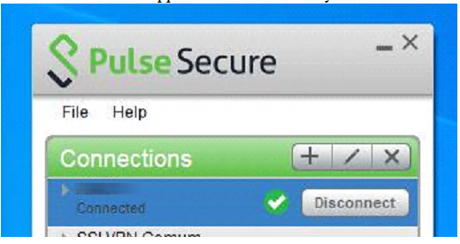

# Access Overview
<!-- REMOVABLE DESCRIPTION
Depending on the project, use a short description of the form the system is accessible, potentially by splitting the
description in case there are multiple DMSs. Below some examples of the typical access methods. Please select and combine
 -->
> ### Attention 🚨
> Access credentials should be stored in the [Skyline Password Manager](https://passwords.skyline.be/).

> ### Access through the squad members
> Credentials are assigned per person and will be applicable for every DMS system in <PRJNAME>. <PRJNAME>
> systems are cloud-connected and remote access is allowed to the <DEPLOY_SQUAD> squad and some members of the support
> team. Please, reach out to [<DEPLOY_SQUAD>](mailto:<EMAIL_SQUAD>) squad in case you need remote access to <PRJNAME> systems.
>

> ### Access via VPN client and credentials
> * Open a web browser and navigate to the <CUSTOMER> [VPN Portal](https://<CUSTOMER_VPN_PORTAL>).
> * Login using the valid VPN credentials available on [Skyline Password Manager](https://passwords.skyline.be/).
> * Select one of the user that can authenticate your connection using the <2FA_AUTHENTICATOR> and select the preferable 
> authentication method(send me a push or enter a password).
> * After successful authentication it should start downloading <VPN_CLIENT> and install it in your PC, if you don't have it yet.
> * The <VPN_CLIENT> should now indicate that you are connected as following:
> 
> * After successful VPN connection, RDP to jump servers and then from jump servers you can RDP to any server either under
>   <DMS_CLUSTER_NAME>cluster.