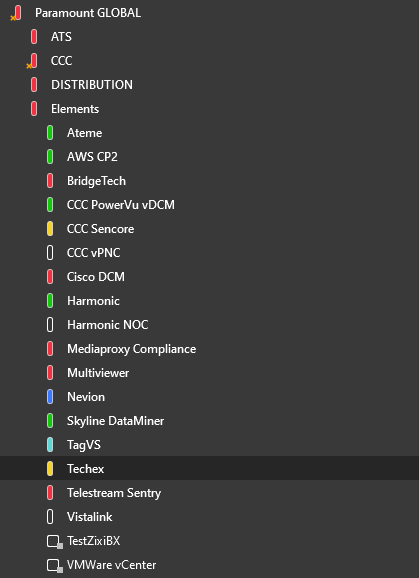
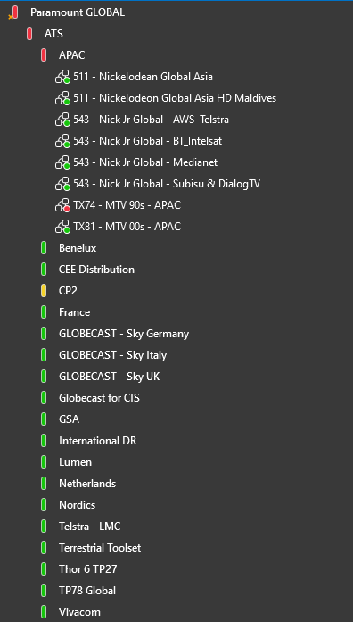
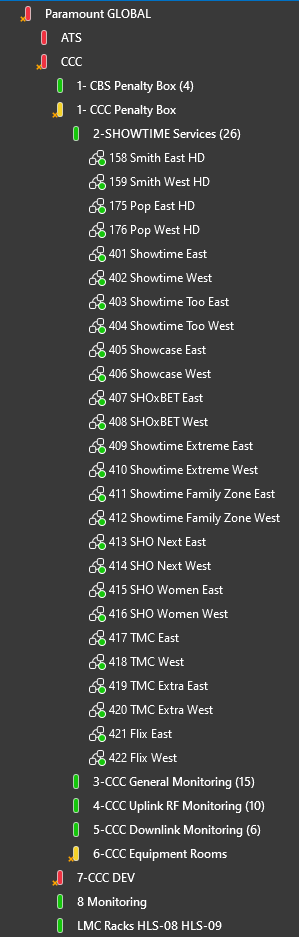
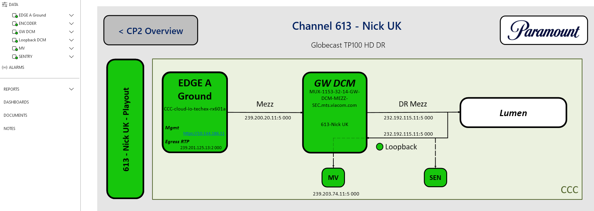
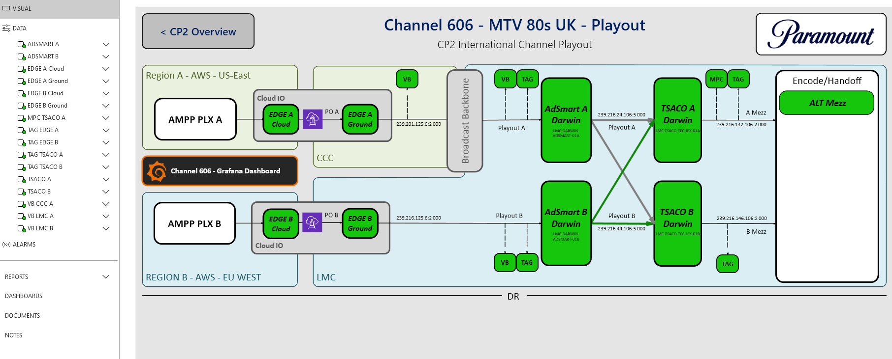
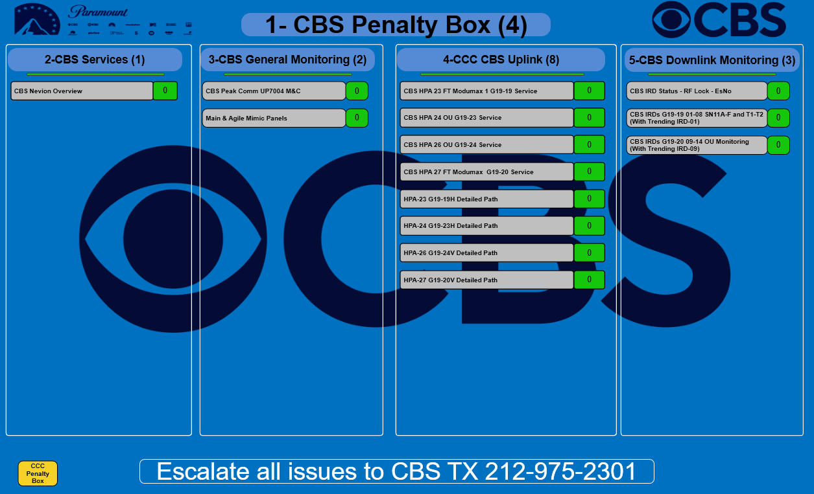
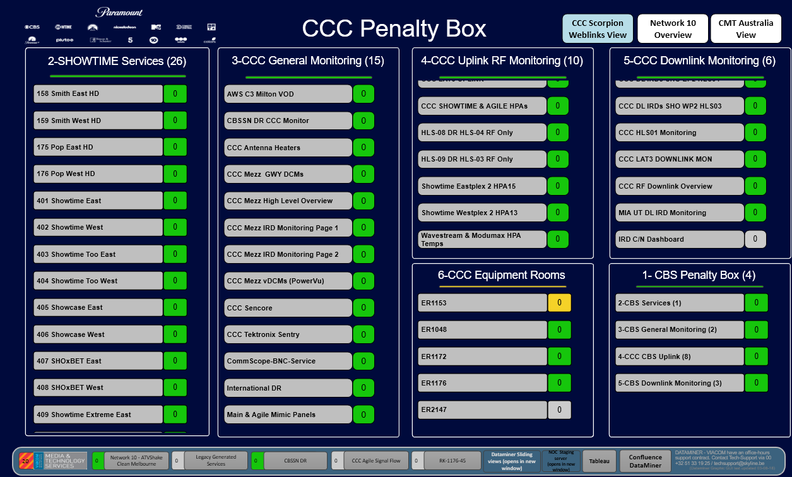

# High Level Architecture

## Elements
Their services contain elements stored within the view located at "Paramount GLOBAL > Elements". 

> 

These are usually categorized in folders containing every instance of a specific type of device (Ex: "Ateme" contains all the "Ateme Titan Edge" elements). If their name contains "lmc", then they are within one of the LMC/London DMAs. If their name contains "CCC", then they are within one of the CCC/New York DMAs. All elements within this folder are live so have caution when changing anything on them. 

## Services

Both the London (LMC) and New York (CCC) staff utilize services to combine parameters on a variety of elements that relate to the same distribution source and alarm on that service. These services are stores in the "Paramount GLOBAL > ATS" view for London and the "Paramount GLOBAL > CCC" view for New York. 

> 

> 

## Service Templates (LMC)

Currently, they are 6 service templates being used within the "ATS" view for their services. The service templates are stored within "Paramount GLOBAL > zz Test AP" and "Paramount GLOBAL > zz Test NC".  

The service templates currently used are: 
- CP2 LMC Aapka Colors Template - Prod
- CP2 LMC DR Template - Prod
- CP2 LMC EncHoff Template - Prod
- CP2 LMC Localised Template - Prod
- CP2 LMC Playout Template - Prod
- Intl Service Template

These templates may have "Prod" or "Dev" at the end of their names. "Prod" denotes if they're currently in use while "Dev" represents if it's a duplicate being used for testing. These templates may also have Visios attached to them to show the connection bath between the elements being used. 
## Service Visios (LMC)

For the London branch (LMC), they utilize visios on each of their services to keep track of the alarms. These Visios detail the connections between the different elements being used to build the connection. 

Here are some examples of the Visios being used: 

On the Service "613 - Nick UK - Globecast TP100 HD DR" based on "CP2 LMC DR Template - Prod" :

> 

From CP2 Playout on the service "606 - MTV 80s UK - Playout" based on "CP2 LMC Playout Template - Prod" :

> 

## Penalty Box Visio (CCC)

For the New York branch (CCC), they primarily use a "Penalty Box" Visio to keep track of alarms for each of the Distributions/Channels under their control. They have two Penalty Boxes: One for the CBS office (Paramount Global > CCC > 1- CBS Penalty Box (4)) and one for the same office which these DMAs are hosted from (Paramount GLOBAL > CCC > 1- CCC Penalty Box). Under each of these views are views separating the locations of each of the services (that are represented by each box in the Visio) which then contain the services being monitored.

> 
> 