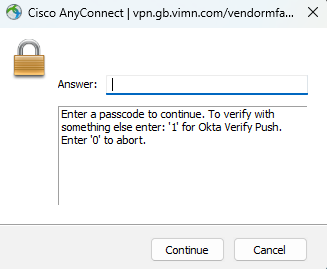

# Access Overview

> ### Attention 🚨
> Access credentials should be stored in the [Skyline Password Manager](https://passwords.skyline.be/).

> ### Access via VPN client and credentials
> * Open a web browser and navigate to this webpage:  [vpn.gb.vimn.com/vendormfa-okta](vpn.gb.vimn.com/vendormfa-okta).

> 

> * Login using the credentials with the email address as the username available on [Skyline Password Manager](https://passwords.skyline.be/) for the "Paramount" customer.
> * You are given two options to authenticate using Two Factor Aunthentication: activate a push by inserting "1" or insert the code provided by the "Okta Verify" app.

> 

> * After successful authentication, it should send you to a screen titled "AnyConnect Secure Mobility Client". You can install the AnyConnect VPN exe on your computer by clicking the link it provides.
> 
> * Once the AnyConnect Secure Mobility CLient is installed, you need to make the connection endpoint be "vpn.gb.vimn.com/vendormfa-okta".
> 
> * Once you press "Connect", you'll be prompted to first put in the password of the account, and then do one of the Two Factor Authentication options just like with the website.

> 

> 

> * After successful VPN connection, you can use DataMiner Cube to connect directly to the Production or Staging Cluster. 

> 

> * You can also RDP to the Production cluster and on that computer RDP to other computers within that cluster. It is also possible to RDP to the Staging cluster.